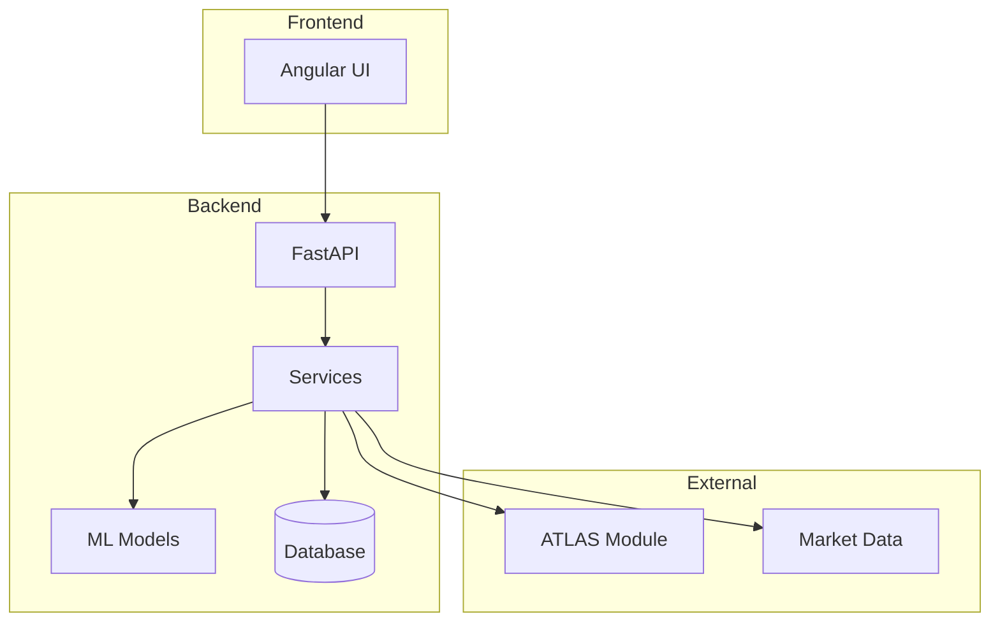
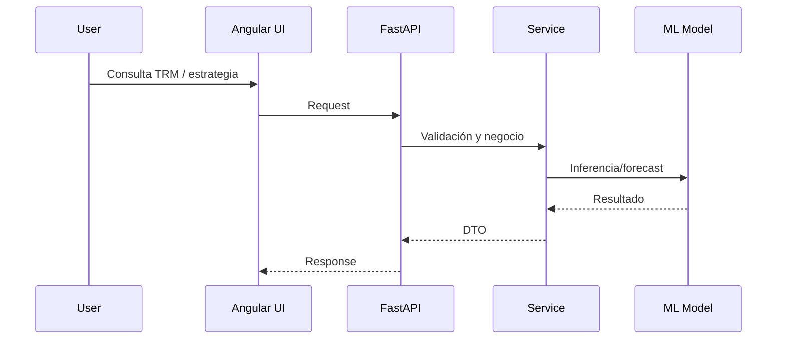

# TRM Agent - Trading y Coberturas USD/COP

## Descripción
Sistema para análisis, proyección y ejecución de estrategias sobre USD/COP (TRM) en Colombia. Incluye un frontend Angular para visualización y un backend FastAPI para APIs, modelos de ML e integración con el módulo ATLAS. Soporta simulación de coberturas con forwards y reglas financieras basadas en diferencial de tasas.

## Stack Tecnológico

| Componente | Tecnología |
|------------|------------|
| Frontend | Angular (TypeScript) |
| Backend | FastAPI (Python) |
| Data/ML | Modelos en `models/` |
| DB Migrations | Alembic |
| Infra | Docker + docker-compose |
| Integraciones | ATLAS |

## Estructura del Proyecto

```
trm agent/
├── src/                          # Frontend Angular
├── angular.json, tsconfig.json
├── package.json
├── ATRIBUTOS_DE_CALIDAD.md
├── REQUERIMIENTOS_NO_TECNICOS.md
├── backend/                      # FastAPI
│   ├── app/                      # API principal
│   ├── alembic/                  # Migraciones
│   ├── models/                   # Modelos ML
│   ├── tests/
│   ├── requirements.txt
│   ├── docker-compose.yml
│   ├── Dockerfile
│   └── simulate_hedging.py       # Simulación de coberturas
└── public/                       # Assets estáticos
```

## Archivos Clave

| Archivo | Propósito |
|---------|-----------|
| `backend/app/` | Rutas, servicios y lógica del API |
| `backend/models/` | Modelos de ML y artefactos |
| `backend/simulate_hedging.py` | Simulación de coberturas con forwards |
| `src/` | UI Angular |
| `ATRIBUTOS_DE_CALIDAD.md` | Atributos de calidad del sistema |
| `REQUERIMIENTOS_NO_TECNICOS.md` | Requisitos no técnicos |

## Comandos Útiles

```bash
# Frontend
npm install
npm start
npm run build
npm test

# Backend
cd backend
python -m venv .venv
. .venv/bin/activate
pip install -r requirements.txt
uvicorn app.main:app --reload --host 127.0.0.1 --port 8000

# Tests backend
pytest -q
```

## Arquitectura





## AI Thinking Rules

### Antes de escribir código SIEMPRE preguntarte:

```yaml
reflexion_obligatoria:
  - "Este codigo se parece a otra parte del proyecto?"
  - "Puedo extraer esto en una funcion reutilizable?"
  - "Estoy creando una dependencia circular?"
  - "Este archivo va a superar 300 lineas?"
  - "Esta funcion va a superar 30 lineas?"
  - "El nombre explica claramente que hace?"
  - "Estoy hardcodeando algo que deberia ser config?"
```

### Principios Core

```yaml
codigo:
  max_file_lines: 300
  max_function_lines: 30
  max_class_methods: 10
  max_parameters: 5

naming:
  python_functions: snake_case
  python_classes: PascalCase
  python_constants: UPPER_SNAKE_CASE
  ts_functions: camelCase
  ts_classes: PascalCase
  ts_constants: UPPER_SNAKE_CASE
  files: kebab-case

principios:
  - "Cada funcion debe hacer UNA cosa"
  - "Preferir composicion sobre herencia"
  - "Fail fast - validar inputs temprano"
  - "No premature optimization"
  - "DRY pero no obsesivo - 3 repeticiones = refactor"
```

## Reglas de Negocio (Cobertura con Forwards)

- El forward fija hoy la TRM futura usando diferencial de tasas, no es pronostico.
- Para exportador (USD->COP): cubrir vendiendo USD a futuro.
- Para importador (COP->USD): cubrir comprando USD a futuro.
- El precio forward se aproxima como:

```text
Forward ≈ Spot × (1 + i_COP × T) / (1 + i_USD × T)
```

- En mercado real: Forward = Spot + puntos forward (tasas + spreads por liquidez/riesgo).

## Integracion ATLAS

- Toda integracion con ATLAS debe estar aislada en un servicio dedicado.
- No mezclar logica ATLAS dentro de controladores o componentes.
- Cualquier cambio de contrato ATLAS debe versionarse y documentarse.

## CTO Rules - Se activan cuando codigo crece 2x

### Checklist Obligatorio

```markdown
## Documentacion
- [ ] README.md actualizado
- [ ] Diagramas de arquitectura al dia
- [ ] Configs y variables de entorno documentadas

## Testing
- [ ] Tests para endpoints nuevos
- [ ] Cobertura > 70% en backend core
- [ ] Casos de borde en logica de cobertura

## Arquitectura
- [ ] Sin dependencias circulares
- [ ] Archivos < 300 lineas
- [ ] Funciones < 30 lineas
- [ ] Servicios separados por responsabilidad

## Seguridad
- [ ] Sin secrets hardcodeados
- [ ] Variables sensibles via .env
- [ ] Logs sin datos sensibles
```

## Anti-Patterns a Evitar

```python
# MAL - logica duplicada
if exposure_type == "export":
    forward = compute_forward(...)
if exposure_type == "export":
    pnl = compute_pnl(...)

# BIEN - funcion unica
if exposure_type == "export":
    result = compute_export_hedge(...)
```

```python
# MAL - hardcodeado
TRM_SPOT = 4000

# BIEN - config/env
TRM_SPOT = float(os.getenv("TRM_SPOT"))
```

## Quick Start

```bash
# Frontend
npm install
npm start

# Backend
cd backend
pip install -r requirements.txt
uvicorn app.main:app --reload --host 127.0.0.1 --port 8000
```

---

**Version**: 1.0.0 - TRM Agent
**Ultima actualizacion**: 2026-02-12
