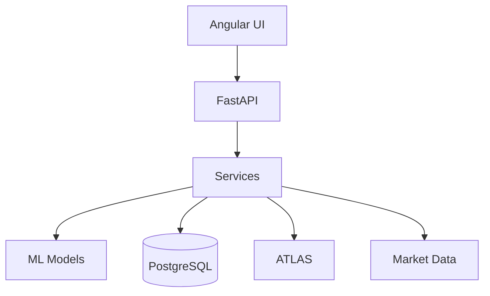

# TRM Agent

Sistema para analisis, proyeccion y ejecucion de estrategias sobre USD/COP (TRM) en Colombia. Incluye un frontend Angular para visualizacion y un backend FastAPI con modelos de ML e integracion con ATLAS.

## Estructura

```
trm agent/
├── src/                          # Frontend Angular
├── public/
├── angular.json, tsconfig.json
├── package.json
├── ATRIBUTOS_DE_CALIDAD.md
├── REQUERIMIENTOS_NO_TECNICOS.md
├── backend/
│   ├── app/                      # API principal
│   ├── alembic/                  # Migraciones
│   ├── models/                   # Modelos ML
│   ├── tests/
│   ├── requirements.txt
│   ├── docker-compose.yml
│   ├── Dockerfile
│   └── simulate_hedging.py
└── CLAUDE.md                     # Reglas del proyecto
```

## Arquitectura (alto nivel)



## Quick start

### Frontend

```bash
npm install
npm start
```

Aplicacion en `http://localhost:4200`.

### Backend

```bash
cd backend
python -m venv .venv
. .venv/bin/activate
pip install -r requirements.txt
uvicorn app.main:app --reload --host 127.0.0.1 --port 8000
```

API docs en `http://localhost:8000/docs`.

## Configuracion

Variables en `backend/.env` (ver `backend/.env.example`).

Ejemplos:
- `DATABASE_URL`
- `REDIS_URL`
- `JWT_SECRET`
- `TELEGRAM_BOT_TOKEN`
- `SLACK_WEBHOOK_URL`

## Pruebas

```bash
# Backend
cd backend
pytest -q
```

## Documentacion adicional

- `ATRIBUTOS_DE_CALIDAD.md`
- `REQUERIMIENTOS_NO_TECNICOS.md`
- `backend/README.md`
